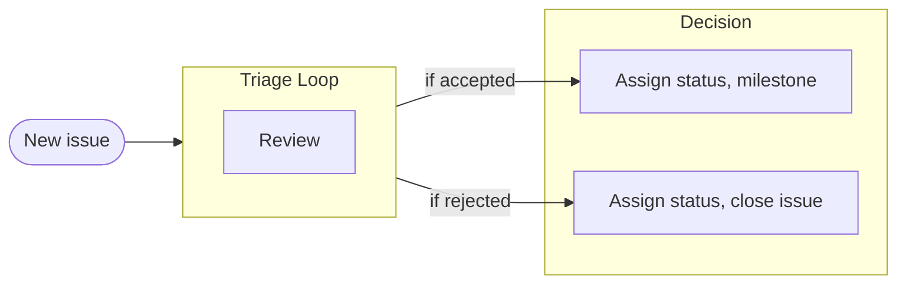
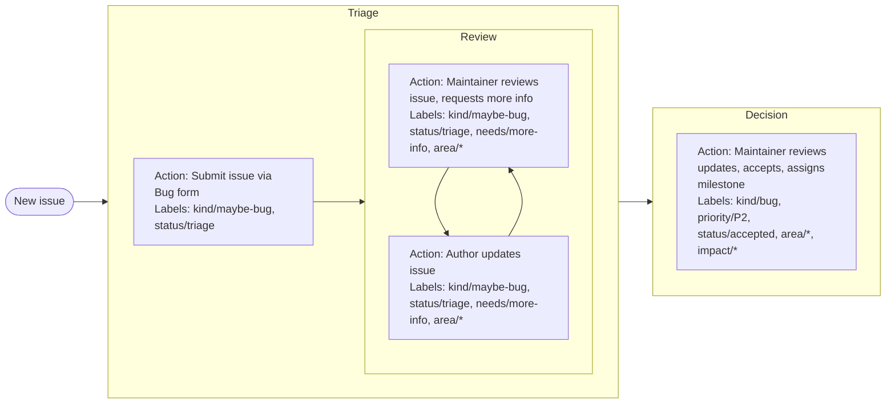
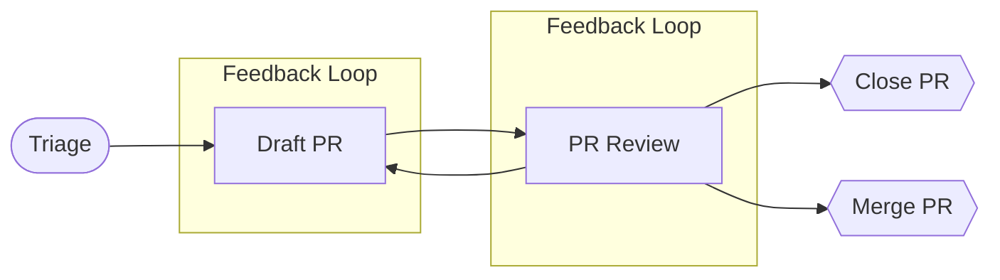

# Project processing guide <!-- omit from toc -->

- [Project scope](#project-scope)
- [Labels](#labels)
  - [Global](#global)
  - [`area/`](#area)
  - [`exp/`](#exp)
  - [`impact/`](#impact)
  - [`kind/`](#kind)
  - [`needs/`](#needs)
  - [`priority/`](#priority)
  - [`status/`](#status)
- [Types of releases](#types-of-releases)
  - [Feature releases](#feature-releases)
    - [Release Candidates](#release-candidates)
    - [Support Policy](#support-policy)
    - [Contributing to Releases](#contributing-to-releases)
  - [Patch releases](#patch-releases)
- [Milestones](#milestones)
- [Triage process](#triage-process)
  - [Verify essential information](#verify-essential-information)
  - [Classify the issue](#classify-the-issue)
- [Prioritization guidelines for `kind/bug`](#prioritization-guidelines-for-kindbug)
- [Issue lifecyle](#issue-lifecyle)
  - [Examples](#examples)
    - [Submitting a bug](#submitting-a-bug)
- [Pull request review process](#pull-request-review-process)
- [Handling stalled issues and pull requests](#handling-stalled-issues-and-pull-requests)
- [Moving to a discussion](#moving-to-a-discussion)
- [Workflow automation](#workflow-automation)
  - [Exempting an issue/PR from stale bot processing](#exempting-an-issuepr-from-stale-bot-processing)
- [Updating dependencies](#updating-dependencies)

---

## Project scope

**Docker Buildx** is a Docker CLI plugin designed to extend build capabilities using BuildKit. It provides advanced features for building container images, supporting multiple builder instances, multi-node builds, and high-level build constructs. Buildx enhances the Docker build process, making it more efficient and flexible, and is compatible with both Docker and Kubernetes environments. Key features include:

- **Familiar user experience:** Buildx offers a user experience similar to legacy docker build, ensuring a smooth transition from legacy commands
- **Full BuildKit capabilities:** Leverage the full feature set of [`moby/buildkit`](https://github.com/moby/buildkit) when using the container driver
- **Multiple builder instances:** Supports the use of multiple builder instances, allowing concurrent builds and effective management and monitoring of these builders.
- **Multi-node builds:** Use multiple nodes to build cross-platform images
- **Compose integration:** Build complex, multi-services files as defined in compose
- **High-level build constructs via `bake`:** Introduces high-level build constructs for more complex build workflows
- **In-container driver support:** Support in-container drivers for both Docker and Kubernetes environments to support isolation/security.

## Labels

Below are common groups, labels, and their intended usage to support issues, pull requests, and discussion processing.

### Global

General attributes that can apply to nearly any issue or pull request.

| Label               | Applies to  | Description                                                               |
| ------------------- | ----------- | ------------------------------------------------------------------------- |
| `bot`               | Issues, PRs | Created by a bot                                                          |
| `good first issue ` | Issues      | Suitable for first-time contributors                                      |
| `help wanted`       | Issues, PRs | Assistance requested                                                      |
| `lgtm`              | PRs         | “Looks good to me” approval                                               |
| `stale`             | Issues, PRs | The issue/PR has not had activity for a while                             |
| `rotten`            | Issues, PRs | The issue/PR has not had activity since being marked stale and was closed |
| `frozen`            | Issues, PRs | The issue/PR should be skipped by the stale-bot                           |
| `dco/no`            | PRs         | The PR is missing a developer certificate of origin sign-off              |

### `area/`

Area or component of the project affected. Please note that the table below may not be inclusive of all current options.

| Label                          | Applies to | Description                |
| ------------------------------ | ---------- | -------------------------- |
| `area/bake`                    | Any        | `bake`                     |
| `area/bake/compose`            | Any        | `bake/compose`             |
| `area/build`                   | Any        | `build`                    |
| `area/builder`                 | Any        | `builder`                  |
| `area/buildkit`                | Any        | Relates to `moby/buildkit` |
| `area/cache`                   | Any        | `cache`                    |
| `area/checks`                  | Any        | `checks`                   |
| `area/ci`                      | Any        | Project CI                 |
| `area/cli`                     | Any        | `cli`                      |
| `area/controller`              | Any        | `controller`               |
| `area/debug`                   | Any        | `debug`                    |
| `area/dependencies`            | Any        | Project dependencies       |
| `area/dockerfile`              | Any        | `dockerfile`               |
| `area/docs`                    | Any        | `docs`                     |
| `area/driver`                  | Any        | `driver`                   |
| `area/driver/docker`           | Any        | `driver/docker`            |
| `area/driver/docker-container` | Any        | `driver/docker-container`  |
| `area/driver/kubernetes`       | Any        | `driver/kubernetes`        |
| `area/driver/remote`           | Any        | `driver/remote`            |
| `area/feature-parity`          | Any        | `feature-parity`           |
| `area/github-actions`          | Any        | `github-actions`           |
| `area/hack`                    | Any        | Project hack/support       |
| `area/imagetools`              | Any        | `imagetools`               |
| `area/metrics`                 | Any        | `metrics`                  |
| `area/moby`                    | Any        | Relates to `moby/moby`     |
| `area/project`                 | Any        | Project support            |
| `area/qemu`                    | Any        | `qemu`                     |
| `area/tests`                   | Any        | Project testing            |
| `area/windows`                 | Any        | `windows`                  |

### `exp/`

Estimated experience level to complete the item

| Label              | Applies to | Description                                                                     |
| ------------------ | ---------- | ------------------------------------------------------------------------------- |
| `exp/beginner`     | Issue      | Suitable for contributors new to the project or technology stack                |
| `exp/intermediate` | Issue      | Requires some familiarity with the project and technology                       |
| `exp/expert`       | Issue      | Requires deep understanding and advanced skills with the project and technology |

### `impact/`

Potential impact areas of the issue or pull request.

| Label                | Applies to | Description                                        |
| -------------------- | ---------- | -------------------------------------------------- |
| `impact/breaking`    | PR         | Change is API-breaking                             |
| `impact/changelog`   | PR         | When complete, the item should be in the changelog |
| `impact/deprecation` | PR         | Change is a deprecation of a feature               |

### `kind/`

The type of issue, pull request or discussion

| Label              | Applies to        | Description                                             |
| ------------------ | ----------------- | ------------------------------------------------------- |
| `kind/bug`         | Issue, PR         | Confirmed bug                                           |
| `kind/chore`       | Issue, PR         | Project support tasks                                   |
| `kind/docs`        | Issue, PR         | Additions or modifications to the documentation         |
| `kind/duplicate`   | Any               | Duplicate of another item                               |
| `kind/enhancement` | Any               | Enhancement of an existing feature                      |
| `kind/feature`     | Any               | A brand new feature                                     |
| `kind/maybe-bug`   | Issue, PR         | Unconfirmed bug, turns into kind/bug when confirmed     |
| `kind/proposal`    | Issue, Discussion | A proposed major change                                 |
| `kind/refactor`    | Issue, PR         | Refactor of existing code                               |
| `kind/support`     | Any               | A question, discussion, or other user support item      |
| `kind/tests`       | Issue, PR         | Additions or modifications to the project testing suite |

### `needs/`

Actions or missing requirements needed by the issue or pull request.

| Label                       | Applies to | Description                                           |
| --------------------------- | ---------- | ----------------------------------------------------- |
| `needs/assignee`            | Issue, PR  | Needs an assignee                                     |
| `needs/code-review`         | PR         | Needs review of code                                  |
| `needs/design-review`       | Issue, PR  | Needs review of design                                |
| `needs/docs-review`         | Issue, PR  | Needs review by the documentation team                |
| `needs/docs-update`         | Issue, PR  | Needs an update to the docs                           |
| `needs/follow-on-work`      | Issue, PR  | Needs follow-on work/PR                               |
| `needs/issue`               | PR         | Needs an issue                                        |
| `needs/maintainer-decision` | Issue, PR  | Needs maintainer discussion/decision before advancing |
| `needs/milestone`           | Issue, PR  | Needs milestone assignment                            |
| `needs/more-info`           | Any        | Needs more information from the author                |
| `needs/more-investigation`  | Issue, PR  | Needs further investigation                           |
| `needs/priority`            | Issue, PR  | Needs priority assignment                             |
| `needs/pull-request`        | Issue      | Needs a pull request                                  |
| `needs/rebase`              | PR         | Needs rebase to target branch                         |
| `needs/reproduction`        | Issue, PR  | Needs reproduction steps                              |

### `priority/`

Level of urgency of a `kind/bug` issue or pull request.

| Label         | Applies to | Description                                                             |
| ------------- | ---------- | ----------------------------------------------------------------------- |
| `priority/P0` | Issue, PR  | Urgent: Security, critical bugs, blocking issues.                       |
| `priority/P1` | Issue, PR  | Important: This is a top priority and a must-have for the next release. |
| `priority/P2` | Issue, PR  | Normal: Default priority                                                |

### `status/`

Current lifecycle state of the issue or pull request.

| Label                 | Applies to | Description                                                            |
| --------------------- | ---------- | ---------------------------------------------------------------------- |
| `status/accepted`     | Issue, PR  | The issue has been reviewed and accepted for implementation            |
| `status/active`       | PR         | The PR is actively being worked on by a maintainer or community member |
| `status/blocked`      | Issue, PR  | The issue/PR is blocked from advancing to another status               |
| `status/do-not-merge` | PR         | Should not be merged pending further review or changes                 |
| `status/transfer`     | Any        | Transferred to another project                                         |
| `status/triage`       | Any        | The item needs to be sorted by maintainers                             |
| `status/wontfix`      | Issue, PR  | The issue/PR will not be fixed or addressed as described               |

## Types of releases

This project has feature releases, patch releases, and security releases.

### Feature releases

Feature releases are made from the development branch, followed by cutting a release branch for future patch releases, which may also occur during the code freeze period.

#### Release Candidates

Users can expect 2-3 release candidate (RC) test releases prior to a feature release. The first RC is typically released about one to two weeks before the final release.

#### Support Policy

Once a new feature release is cut, support for the previous feature release is discontinued. An exception may be made for urgent security releases that occur shortly after a new feature release. Buildx does not offer LTS (Long-Term Support) releases.

#### Contributing to Releases

Anyone can request that an issue or PR be included in the next feature or patch release milestone, provided it meets the necessary requirements.

### Patch releases

Patch releases should only include the most critical patches. Stability is vital, so everyone should always use the latest patch release.

If a fix is needed but does not qualify for a patch release because of its code size or other criteria that make it too unpredictable, we will prioritize cutting a new feature release sooner rather than making an exception for backporting.

Following PRs are included in patch releases

- `priority/P0` fixes
- `priority/P1` fixes, assuming maintainers don’t object because of the patch size
- `priority/P2` fixes, only if (both required)
    - proposed by maintainer
    - the patch is trivial and self-contained
- Documentation-only patches
- Vendored dependency updates, only if:
    - Fixing (qualifying) bug or security issue in Buildx
    - The patch is small, else a forked version of the dependency with only the patches required

New features do not qualify for patch release.

## Milestones

Milestones are used to help identify what releases a contribution will be in. 

- The `v0.next` milestone collects unblocked items planned for the next 2-3 feature releases but not yet assigned to a specific version milestone.
- The `v0.backlog` milestone gathers all triaged items considered for the long-term (beyond the next 3 feature releases) or currently unfit for a future release due to certain conditions. These items may be blocked and need to be unblocked before progressing.

## Triage process

Triage provides an important way to contribute to an open-source project. When submitted without an issue this process applies to Pull Requests as well. Triage helps ensure work items are resolved quickly by:

- Ensuring the issue's intent and purpose are described precisely. This is necessary because it can be difficult for an issue to explain how an end user experiences a problem and what actions they took to arrive at the problem.
- Giving a contributor the information they need before they commit to resolving an issue.
- Lowering the issue count by preventing duplicate issues.
- Streamlining the development process by preventing duplicate discussions.

If you don't have time to code, consider helping with triage. The community will thank you for saving them time by spending some of yours. The same basic process should be applied upon receipt of a new issue.

1. Verify essential information
2. Classify the issue
3. Prioritizing the issue

### Verify essential information

Before advancing the triage process, ensure the issue contains all necessary information to be properly understood and assessed. The required information may vary by issue type, but typically includes the system environment, version numbers, reproduction steps, expected outcomes, and actual results.

- **Exercising Judgment**: Use your best judgment to assess the issue description’s completeness.
- **Communicating Needs**: If the information provided is insufficient, kindly request additional details from the author. Explain that this information is crucial for clarity and resolution of the issue, and apply the `needs/more-information` label to indicate a response from the author is required.

### Classify the issue

An issue will typically have multiple labels. These are used to help communicate key information about context, requirements, and status. At a minimum, a properly classified issue should have:

- (Required) One or more [`area/*`](#area) labels
- (Required) One [`kind/*`](#kind) label  to indicate the type of issue
- (Required if `kind/bug`) A [`priority/*`](#priority) label

When assigning a decision the following labels should be present:

- (Required) One [`status/*`](#status) label  to indicate lifecycle status

Additional labels can provide more clarity:

- Zero or more [`needs/*`](#needs) labels to indicate missing items
- Zero or more [`impact/*`](#impact) labels
- One [`exp/*`](#exp) label

## Prioritization guidelines for `kind/bug`

When an issue or pull request of `kind/bug` is correctly categorized and attached to a milestone, the labels indicate the urgency with which it should be completed. 

**priority/P0**

Fixing this item is the highest priority. A patch release will follow as soon as a patch is available and verified. This level is used exclusively for bugs.

Examples:

- Regression in a critical code path
- Panic in a critical code path
- Corruption in critical code path or rest of the system
- Leaked zero-day critical security

**priority/P1**

Items with this label should be fixed with high priority and almost always included in a patch release. Unless waiting for another issue, patch releases should happen within a week. This level is not used for features or enhancements.

Examples:

- Any regression, panic
- Measurable performance regression
- A major bug in a new feature in the latest release
- Incompatibility with upgraded external dependency

**priority/P2**

This is the default priority and is implied in the absence of a `priority/` label. Bugs with this priority should be included in the next feature release but may land in a patch release if they are ready and unlikely to impact other functionality adversely. Non-bug issues with this priority should also be included in the next feature release if they are available and ready.

Examples:

- Confirmed bugs
- Bugs in non-default configurations
- Most enhancements

## Issue lifecyle

### Examples

#### Submitting a bug

To help illustrate the issue life cycle let’s walk through submitting an issue as a potential bug in CI that enters a feedback loop and is eventually accepted as P2 priority and placed on the backlog.

## Pull request review process

A thorough and timely review process for pull requests (PRs) is crucial for maintaining the integrity and quality of the project while fostering a collaborative environment.

- **Labeling**: Most labels should be inherited from a linked issue. If no issue is linked an extended review process may be required.
- **Continuous Integration**: With few exceptions, it is crucial that all Continuous Integration (CI) workflows pass successfully.
- **Draft Status**: Incomplete or long-running PRs should be placed in "Draft" status. They may revert to "Draft" status upon initial review if significant rework is required.

## Handling stalled issues and pull requests

Unfortunately, some issues or pull requests can remain inactive for extended periods. To mitigate this, automation is employed to prompt both the author and maintainers, ensuring that all contributions receive appropriate attention.

**For Authors:**

- **Closure of Inactive Items**: If your issue or PR becomes irrelevant or is no longer needed, please close it to help keep the project clean.
- **Prompt Responses**: If additional information is requested, please respond promptly to facilitate progress.

**For Maintainers:**

- **Timely Responses**: Endeavor to address issues and PRs within a reasonable timeframe to keep the community actively engaged.
- **Engagement with Stale Issues**: If an issue becomes stale due to maintainer inaction, re-engage with the author to reassess and revitalize the discussion.

**Stale and Rotten Policy:**

- An issue or PR will be labeled as **`stale`** after 14 calendar days of inactivity. If it remains inactive for another 30 days, it will be labeled as **`rotten`** and closed.
- Authors whose issues or PRs have been closed are welcome to re-open them or create new ones and link to the original.

**Skipping Stale Processing:**

- To prevent an issue or PR from being marked as stale, label it as **`frozen`**.

**Exceptions to Stale Processing:**

- Issues or PRs marked as **`frozen`**.
- Issues or PRs assigned to a milestone.

## Moving to a discussion

Sometimes, an issue or pull request may not be the appropriate medium for what is essentially a discussion. In such cases, the issue or PR will either be converted to a discussion or a new discussion will be created. The original item will then be labeled appropriately (**`kind/discussion`** or **`kind/question`**) and closed.

If you believe this conversion was made in error, please express your concerns in the new discussion thread. If necessary, a reversal to the original issue or PR format can be facilitated.

## Workflow automation

To help expedite common operations, avoid errors and reduce toil some workflow automation is used by the project. This can include:

- Stale issue or pull request processing
- Auto-labeling actions
- Auto-response actions
- Label carry over from issue to pull request

### Exempting an issue/PR from stale bot processing

The stale item handling is configured in the [repository](link-to-config-file). To exempt an issue or PR from stale processing you can:

- Add the item to a milestone
- Add the `frozen` label to the item

## Updating dependencies

- **Runtime Dependencies**: Use the latest stable release available when the first Release Candidate (RC) of a new feature release is cut. For patch releases, update to the latest corresponding patch release of the dependency.
- **Other Dependencies**: Always permitted to update to the latest patch release in the development branch. Updates to a new feature release require justification, unless the dependency is outdated. Prefer tagged versions of dependencies unless a specific untagged commit is needed. Go modules should specify the lowest compatible version; there is no requirement to update all dependencies to their latest versions before cutting a new Buildx feature release.
- **Patch Releases**: Vendored dependency updates are considered for patch releases, except in the rare cases specified previously.
- **Security Considerations**: A security scanner report indicating a non-exploitable issue via Buildx does not justify backports.
