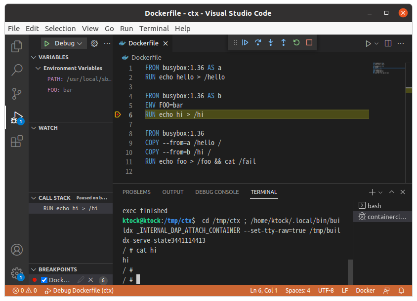
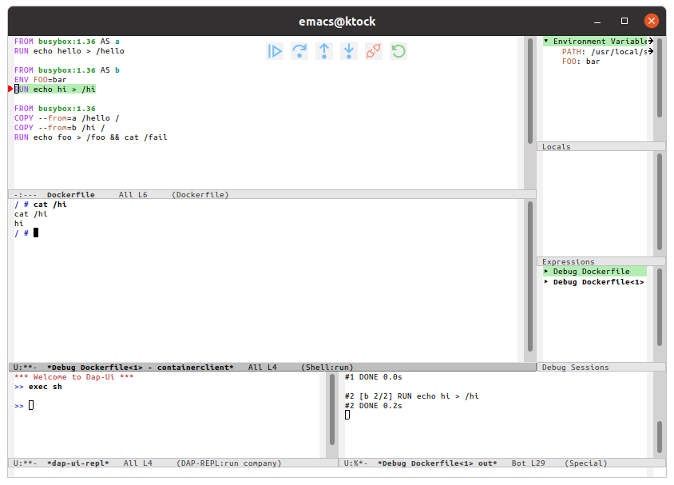

# Breakpoint debugger (experimental)

## Debugger on the monitor

You can use `--invoke=debug-step` to use breakpoint debugger.

This doesn't perform the build but immediately launches the debug monitor.
You can continue the build on the monitor in a step-by-step manner.
`show` command shows the source file with breakpoint information.

```
$ BUILDX_EXPERIMENTAL=1 buildx build --invoke=debug-step /tmp/ctx3
INFO: connecting to buildx server
INFO: no buildx server found; launching...
[+] Building 3.2s (5/5) FINISHED                                                
 => [internal] booting buildkit                                            0.6s
 => => starting container buildx_buildkit_testbuilder0                     0.6s
 => [internal] load build definition from Dockerfile                       0.0s
 => => transferring dockerfile: 87B                                        0.0s
 => [internal] load .dockerignore                                          0.0s
 => => transferring context: 2B                                            0.0s
 => [internal] load metadata for docker.io/library/busybox:latest          2.3s
 => [auth] library/busybox:pull token for registry-1.docker.io             0.0s
Launching interactive container. Press Ctrl-a-c to switch to monitor console
/ # Switched IO
(buildx) show
Filename: "Dockerfile"
      1| FROM busybox
      2| RUN echo hi > /hi
      3| RUN echo aaaa > /a
```

You can start the build using `continue` command.
`=>` shows the position where the build is pausing.

```
(buildx) continue
...
Break at [stopOnEntry]
Filename: "Dockerfile"
 =>   1| FROM busybox
      2| RUN echo hi > /hi
      3| RUN echo aaaa > /a
```

You can set a breakpoint using `break` command.
The position of the breakpoint is shown by `*` on the `show` command output.

```
(buildx) break 3
(buildx) show
Filename: "Dockerfile"
 =>   1| FROM busybox
      2| RUN echo hi > /hi
*     3| RUN echo aaaa > /a
```

`continue` resumes the build and stops when it encounters a breakpoint.
You can switch to the shell using `C-a-c` and inspect the filesystem.

```
(buildx) continue
[+] Building 0.0s (2/2) FINISHED                                                
 => CACHED [1/3] FROM docker.io/library/busybox@sha256:7b3ccabffc97de872a  0.0s
 => => resolve docker.io/library/busybox@sha256:7b3ccabffc97de872a30dfd23  0.0s
 => CACHED [2/3] RUN echo hi > /hi                                         0.0s
[+] Building 0.0s (3/3) FINISHED                                                
 => CACHED [1/3] FROM docker.io/library/busybox@sha256:7b3ccabffc97de872a  0.0s
 => => resolve docker.io/library/busybox@sha256:7b3ccabffc97de872a30dfd23  0.0s
 => CACHED [3/3] RUN echo aaaa > /a                                        0.0s
 => CACHED [2/3] RUN echo hi > /hi                                         0.0s
Break at [1]
Filename: "Dockerfile"
      1| FROM busybox
      2| RUN echo hi > /hi
*=>   3| RUN echo aaaa > /a

(buildx) Switched IO

/ # cat /a
aaaa
```

- Implemented commands
  - `show`: shows the Dockerfile
  - `break`: set a breakpoint at the specified line
  - `breakpoints`: list key-value pairs of available breakpoints
  - `clear`: clear the breakpoint specified by the key
  - `clearall`: clear all breakpoints
  - `next`: proceed to the next line
  - `continue`: resume the build until the next breakpoint
  
## Debugger on IDEs

The breakpoint debugger can be used on IDEs.
The monitor provides DAP API for IDEs so that the breakpoint debugger can be controlled via the editor's UI.

### VS Code

You can use `vscode-buildx-debugger` extension.
Buildx needs to be available via PATH environtmen variable.

Install the VSIX file to VS Code as the following:

```
code --install-extension vscode-buildx-debugger-${VERSION}.vsix
```

You can lanuch the debugger by putting `launch.json` in `.vscode` in the project directory.

```
{
    "version": "0.2.0",
    "configurations": [
	{
	    "type": "dockerfile",
	    "request": "launch",
	    "name": "Debug Dockerfile",
	    "program": "${workspaceFolder}/Dockerfile",
	    "stopOnEntry": true
	}
}
```



### Emacs

- Requirements
  - [dap-mode](https://github.com/emacs-lsp/dap-mode)
    - configuration guide: https://emacs-lsp.github.io/dap-mode/page/configuration/

The following config enables emacs to use buildx as a breakpoint debugger for Dockerfile.
Buildx needs to be available via PATH environtmen variable.

```
(require 'dap-mode)
(require 'dap-utils)

(dap-register-debug-provider "dockerfile" 'dap-dockerfile--populate-default-args)

(defun dap-dockerfile--populate-default-args (conf)
  "Populate CONF with the default arguments."
  (-> conf
    (dap--put-if-absent :program buffer-file-name)
    (dap--put-if-absent :dap-server-path (list "buildx" "dap"))))

(dap-register-debug-template "Dockerfile Debug Configuration"
                             (list :type "dockerfile"
                                   :request "launch"
                                   :stopOnEntry t
                                   :name "Debug Dockerfile"
                                   :environment-variables '(("BUILDX_EXPERIMENTAL" . "1"))
                                   ))
```

To launch the debugger, `M-x dap-debug` then select `Dockerfile Debug Configuration` template.

dap-mode also supports `launch.json` of VS Code. 
dap-mode looks up `launch.json` under `(lsp-workspace-root)` and loads it.
Refer to the [dap-mode document](https://github.com/emacs-lsp/dap-mode/blob/5e449c864107e08353fd21c44897c4d480190d94/docs/page/features.md#launchjson-support) for details.



### Neovim

- Requirements
  - Neovim (>= 0.6)

The following [packer.nvim](https://github.com/wbthomason/packer.nvim) config enables neovim to use buildx as a breakpoint debugger for Dockerfile.
Add it to your packer.nvim config location (e.g. `~/.config/nvim/init.lua`, `~/.config/nvim/lua/plugins.lua`, etc.).
Buildx needs to be available via PATH environtmen variable.

```
require'packer'.startup(function()
        use "mfussenegger/nvim-dap"
end)

local dap = require("dap")

dap.adapters.dockerfile = {
  type = 'executable';
  command = '/path/to/buildx';
  args = { 'dap' };
  options = {
    env = {
      'BUILDX_EXPERIMENTAL=1'
    },
  };
}

dap.configurations.dockerfile = {
    {
        type = "dockerfile",
        name = "Dockerfile Configuration",
        request = "launch",
        stopOnEntry = true,
        program = "${file}",
    },
}
```

nvim-dap also supports a subset of `launch.json` of VS Code. 
`:lua require('dap.ext.vscode').load_launchjs()` searches `launch.json` under the current working directory and loads it.
Refer to the [nvim-dap document](https://github.com/mfussenegger/nvim-dap/blob/f4a3be57f61893cffa1e22aa5e1e7bded495fcf2/doc/dap.txt#L231-L283) for details.

See also [`:help dap.txt`](https://github.com/mfussenegger/nvim-dap/blob/master/doc/dap.txt) of nvim-dap for available commands.


### Launch Configuration

In the launch configuration (e.g. `launch.json` on VS Code), the following properties are provided.

- `program` *string* **REQUIRED** : Absolute path to Dockerfile.
- `stopOnEntry` *boolean* : Automatically stop after launch. (default: `true`)
- `target` *string* : Target build stage to build.
- `build-args` *array* : Build-time variables.
- `ssh` *array* : Allow forwarding SSH agent to the build. Format: `default|<id>[=<socket>|<key>[,<key>]]`
- `secrets` *array* : Expose secret value to the build. Format: `id=secretname,src=filepath`
- `root` *string* : Root directory for controller server.
- `controller-mode` *string* : Mode to launch the controller (`local` vs `remote`(default))
- `server-config` *string* : Path to the controller server configuration file.

Common and mandatory properties are the following (see [VS Code documentation](https://code.visualstudio.com/docs/editor/debugging#_launchjson-attributes) for details).

- `type` : Type of debugger to use. Must be `dockerfile`.
- `request` : The request type. `launch` is only supported as of now.
- `name` : The reader-friendly name of this configuration.

### Repl commands

#### exec

```
NAME:
   buildx exec - Execute command in the step

USAGE:
   exec [OPTIONS] [ARGS...]

If ARGS isn't provided, "/bin/sh" is used by default.


OPTIONS:
   --init-state               Execute commands in an initial state of that step
   --tty, -t                  Allocate tty (enabled by default)
   -i                         Enable stdin (FIXME: must be set with tty) (enabled by default)
   --env value, -e value      Set environment variables
   --workdir value, -w value  Working directory inside the container
   --rollback                 Kill running processes and recreate the debugging container
```

#### ps

```
NAME:
   buildx ps - List attachable processes.

USAGE:
   ps
```

### attach

```
NAME:
   buildx attach - Attach to a processes.

USAGE:
   attach PID
```

#### help

```
NAME:
    - Shows a list of commands or help for one command

USAGE:
    [command]
```

### Known Limitations

Following lists the current known limitations that should be eliminated in the futural version.

- `Step Into` and `Step Out` in Debug toolbar is unsupported. To inspect instructions deeper, you can use [`exec`](#exec) REPL command instead.
- Logpoint, conditional, function and data breakpoints aren't supported.
- Setting value to a variable isn't supported.
- `attach` request type in launch configuration isn't supported.

